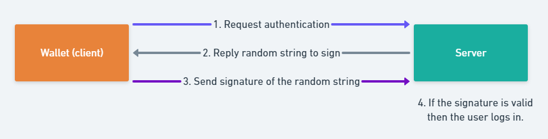

# Wallet Login with digital signature

## Digital signature
Digital signature is a mathematical technique to validate the authenticity and integrity of a message.
In blockchain, almost every action uses digital signature and it is the most basic and fundamental mathematical 
techique that comprises the blockchain technology. 
*(This article is wrote under the assumption that readers have basic knowledge about hash and PKC)*

Typically, there are 3 steps in digital signature in crypto world. 

1. Data Hashing
2. Signing
3. Verifying

### Data Hashing
The first step is to hash the message or the data. By inputting the message(data) through the hashing algorithm, it will return the hash value with same length.
The original message(data) could vary in length however the output's length will always be the same. This is one of the basic trait of a hashing algorithm.
For cryptocurrencies, message(data) is always hashed because dealing with fixed length strings makes the process smooth, although it is not a must to hash the message(data) before signing.

### Signing
When signing the hashed message(data), PKC uses its private key to sign the data and its distinct public key to verify that you actually sent the message.
Although the notion of signing the message(data) with private key and verifying with its distinct public key is same for all PKC, but mathematical algorithm and mechanisms vary according to what digital signature algorithm you use.

### Verifying
With some mathematical operations this stage validates if the signature is actually signed by the private key of that distinct public key.
For instance, *A1* wrote a message to *B2*, hashed it and signed it using the private key. When *B2* receives the message, *B2* is able to verify by using the public key presented by *A1*.
*B2* can be certain that *A1* created the signature since *A1* is the only person having the private key that corresponds to that public key.

These 3 steps work altogether to ensure ***Integrity***, ***Autheticity***, ***Non-repudiation***.

**Integrity** can be ensured since the signature will totally differ if anything gets modified.

**Authenticity** can be ensured since only the holder of private key can create signature.

**Non-repudiation** can be ensured. Once the signature has been generated, ***A1*** can't deny having signed it in the future.(Unless his private key gets compromised)

### Digital signature in Blockchain(ethereum)
For instance, when you send/sign transactions, sign messages digital signature is used to validate if you are the owner of the account.

To sum up, every action that modifies the state variable in blockchain uses digital signature to validate the address.

In this wallet login system, we utilize digital signature to confirm if the user is genuinely the owner of the account and push notification to
evade major sniffing attacks and dns spoofing attacks. *(2 channel authentication)*

## Validation Logic
The basic notion of wallet login is to use **sign** feature of wallet to authentication user's validity.



To elaborate each procedures in wallet login 

### 1. Client who is the owner of the wallet clicks the ***login*** button to login.
#### 1-1. We retrieve the address of the account by calling 
```javascript
window.ethereum.request({ method: 'eth_requestAccounts' });
```
and send it to the server.
*(User approbation is mandatory as wallets won't return address unless the user approves and return 4001 Provider Error (User Rejected Request) according to [EIP-1193](https://github.com/ethereum/EIPs/blob/master/EIPS/eip-1193.md))*
### 2. The server will reply with a random string and let the client(wallet) sign it.
### 3. User signs the random string by calling ``eth_sign``
```javascript
window.ethereum.request({ method: 'eth_sign', params: ['0x9b2055d370f73ec7d8a03e965129118dc8f5bf83', 'ThIsisARaNdoMsTrINg'] });
```
or to avoid controversy regarding security 
I recommend using ``personal_sign``.
```javascript
window.ethereum.request({ method: 'personal_sign', params: ['ThIsisARaNdoMsTrINg', '0x9b2055d370f73ec7d8a03e965129118dc8f5bf83'] });
```
The main difference between ``eth_sign`` and ``personal_sign`` is whether the prefix is joined or not.
This is also in relation with pass #1 and pass #2 sign.
For precise explanation, please click [here](https://docs.metamask.io/guide/signing-data.html#signing-data-with-metamask) and [here](https://docs.walletconnect.org/json-rpc-api-methods/ethereum).

### 4. The server verifies the signature
After the client(wallet) signs the message, signature is sent to the server and server verifies the signature.
Since Ethereum uses ECDSA cryptography. We need to use math libraries to verify it.

There are several examples already implemented by developers and among them 
we chose [simplito's](https://github.com/simplito/elliptic-php#verifying-ethereum-signature) implementation.
```php
use Elliptic\EC;
use kornrunner\Keccak;

function pubKeyToAddress($pubkey) {
    return "0x" . substr(Keccak::hash(substr(hex2bin($pubkey->encode("hex")), 1), 256), 24);
}

function verifySignature($message, $signature, $address) {
    /* Pass 1 sign */
    $msglen = strlen($message);
    $hash   = Keccak::hash("\x19Ethereum Signed Message:\n{$msglen}{$message}", 256);
    $sign   = ["r" => substr($signature, 2, 64), 
               "s" => substr($signature, 66, 64)];
    $recid  = ord(hex2bin(substr($signature, 130, 2))) - 27; 
    if ($recid != ($recid & 1)) 
        return false;

    $ec = new EC('secp256k1');
    $pubkey = $ec->recoverPubKey($hash, $sign, $recid);

    return $address == pubKeyToAddress($pubkey);
}

$address   = "0x5a214a45585b336a776b62a3a61dbafd39f9fa2a";
$message   = "I like signatures";
// signature returned by eth.sign(address, message)
$signature = "0xacb175089543ac060ed48c3e25ada5ffeed6f008da9eaca3806e4acb707b9481401409ae1f5f9f290f54f29684e7bac1d79b2964e0edcb7f083bacd5fc48882e1b";

if (verifySignature($message, $signature, $address)) {
    echo "Success\n";
} else {
    echo "Fail\n";
}
```
This is the implemenation of verifying ***Pass 1 sign***, in order to cope with and verify **Pass 2 sign** we need some modification.

***Notice***

***Modification** is not neccessary if the method called uses ***Pass 1 signature****

Below is the implementation of ***Pass 2 sign*** verification.
```php
public function verifySignature($message, $signature, $address)
{
	/* Pass 2 sign */
	$hash = \kornrunner\Keccak::hash($message, 256);
	$sign = ['r' => substr($signature, 2, 64),
		's' => substr($signature, 66, 64), ];
	$recid = ord(hex2bin(substr($signature, 130, 2))) - 27;
		if ($recid != ($recid & 1))
	{
		return false;
	}
	$ec = new \Elliptic\EC('secp256k1');
	$pubkey = $ec->recoverPubKey($hash, $sign, $recid);
	return strtolower($address) == $this->pubKeyToAddress($pubkey);
}
```

Now that we know how to implement each major procedures, we can implement wallet-login service.

#### Conclusion

GOB Platform uses caching, push notifications and many different cryptographical technologies to optimize and ensure state-of-the-art security and performance.

By ensuring these state-of-the-art performance and security it make it almost impossible to break into the
system and do things malicious or unexpected.

As always GOB will endeavor to make the best services.

Thanks for reading.
